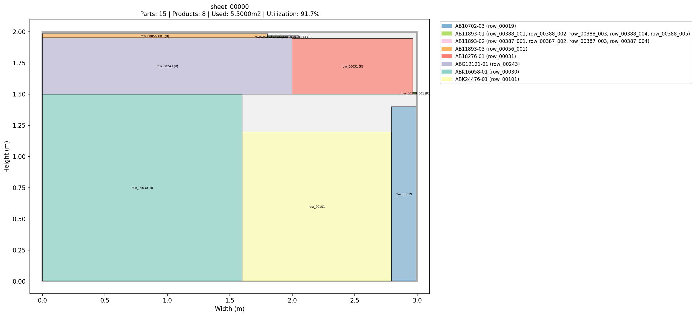
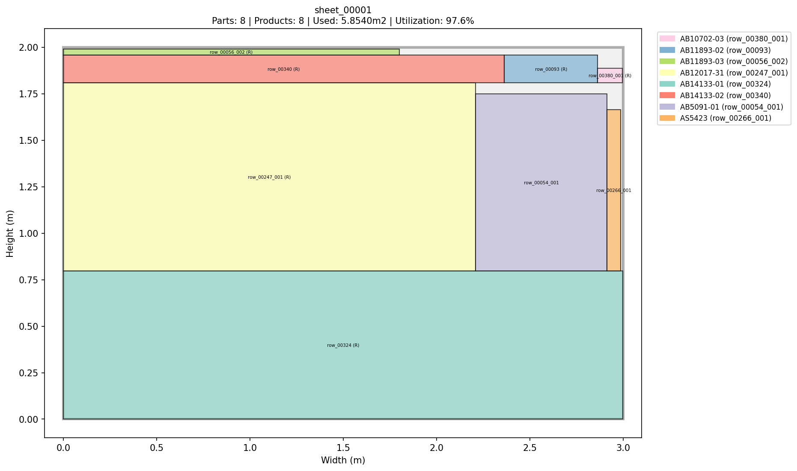
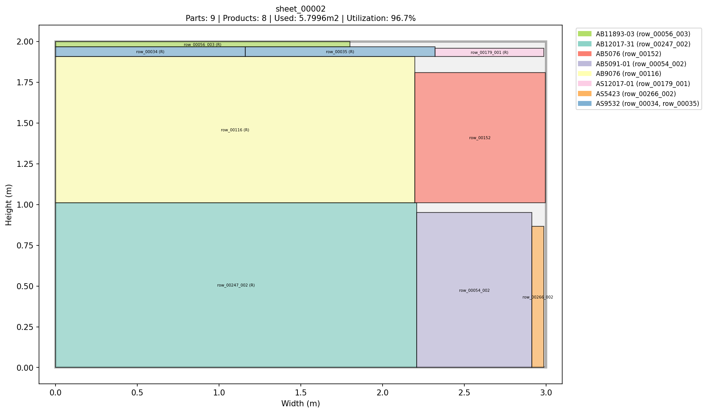
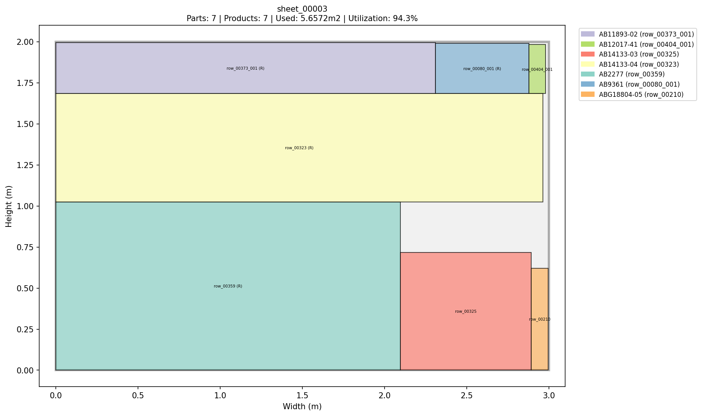
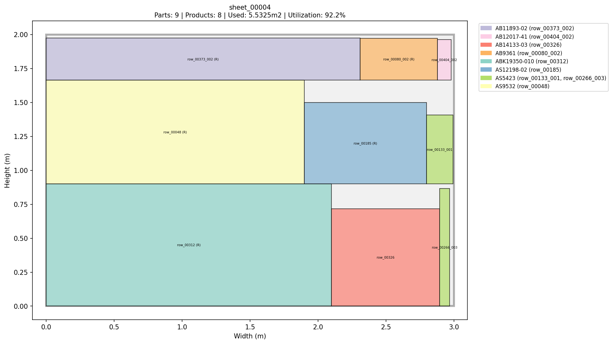
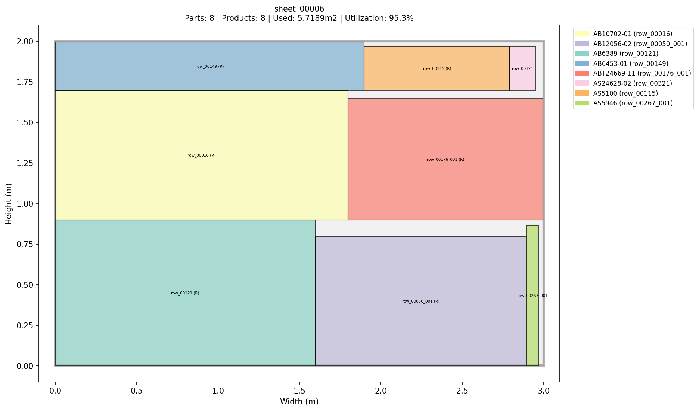
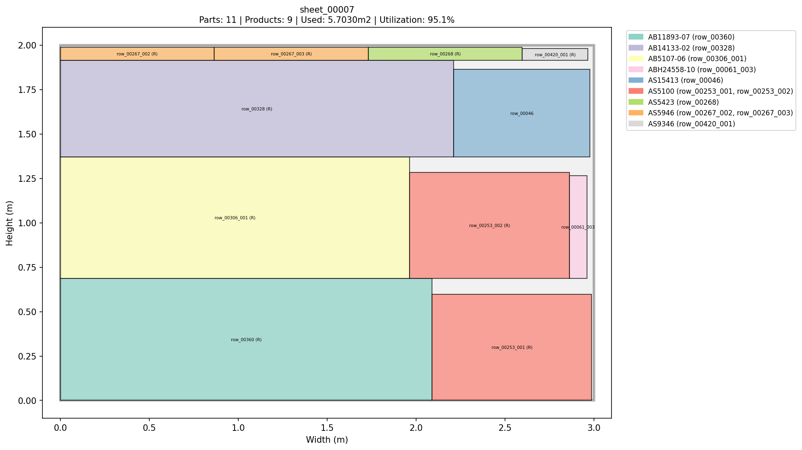

# FJSP - Flexible Job Shop Scheduling Problem Solver

A comprehensive solution for solving Flexible Job Shop Scheduling Problems (FJSP) in sheet-based manufacturing systems. Parts are packed into sheets, and sheets flow through a sequence of processing stations.

## Table of Contents

1. [Overview](#overview)
2. [Installation](#installation)
3. [Quick Start](#quick-start)
4. [Project Structure](#project-structure)
5. [Configuration](#configuration)
6. [Input Data Format](#input-data-format)
7. [Output Files](#output-files)
8. [Core Concepts](#core-concepts)
9. [Algorithm Details](#algorithm-details)
10. [API Reference](#api-reference)
11. [Future Extensions](#future-extensions)

---

## Overview

This FJSP solver handles a sheet-based manufacturing system where:

- **Parts** are physical pieces to be manufactured
- **Products** are composed of multiple parts
- **Sheets** are containers (bins) that hold multiple parts based on area capacity
- **Stations** are processing stations with parallel machines

The goal is to minimize a composite objective of **waste** (unused sheet area) and **processing time** (makespan).

### Key Features

- First-Fit Decreasing (FFD) bin packing algorithm
- FIFO scheduling through stations
- Multi-machine support per station
- Comprehensive output generation (CSV files + sheet images)
- Configurable evaluation weights

---

## Installation

### Requirements

- Python 3.8+
- pandas
- openpyxl (for Excel file support)
- matplotlib (optional, for sheet image generation)

### Install Dependencies

```bash
pip install pandas openpyxl matplotlib
```

---

## Quick Start

1. **Configure your data file** in `config/config.json`:

```json
{
  "data_file": "data/your_data.xlsx",
  "stations": [...],
  "sheet_capacity": 3.6,
  "sheet_X": 2,
  "sheet_Y": 1.8
}
```

2. **Run the solver**:

```bash
python main.py
```

3. **Check the output** in `output/{data_name}_{timestamp}/`

---

## Project Structure

```
project/
├── main.py                 # Entry point
├── output_generator.py     # Output files and sheet images
├── visualizer.py           # Console visualization
├── config/
│   └── config.json       # Configuration file
├── data/
│   └── *.xlsx              # Input data files
├── models/
│   ├── __init__.py
│   ├── part.py             # Part dataclass
│   ├── product.py          # Product dataclass
│   ├── station.py          # Station dataclass
│   ├── sheet.py            # Sheet class
│   └── problem.py          # Problem class (data loading)
├── solution/
│   ├── __init__.py
│   ├── assignment.py       # SheetAssignment dataclass
│   └── solution.py         # Solution class
├── evaluation/
│   ├── __init__.py
│   ├── base.py             # Abstract Evaluator
│   └── weighted.py         # WeightedEvaluator
├── solvers/
│   ├── __init__.py
│   ├── base.py             # Abstract Solver
│   └── greedy.py           # GreedySolver
├── output/                 # Generated outputs
│   └── {run_folder}/
│       ├── sheets/         # Sheet images (PNG)
│       ├── sheet_parts.csv
│       ├── sheet_summary.csv
│       ├── product_summary.csv
│       ├── schedule.csv
│       └── solution_summary.txt
└── docs/                   # Documentation
```

---

## Configuration

The configuration file `config/config.json` contains all settings:

```json
{
  "data_file": "data/5693_cleaned.xlsx",
  "stations": [
    {"name": "wa", "order_index": 0, "num_machines": 2},
    {"name": "wf", "order_index": 1, "num_machines": 2},
    {"name": "wd", "order_index": 2, "num_machines": 1},
    {"name": "wo", "order_index": 3, "num_machines": 1},
    {"name": "wg", "order_index": 4, "num_machines": 2},
    {"name": "wv", "order_index": 5, "num_machines": 1},
    {"name": "wx", "order_index": 6, "num_machines": 1}
  ],
  "sheet_capacity": 3.6,
  "sheet_X": 2,
  "sheet_Y": 1.8
}
```

### Configuration Parameters

| Parameter | Type | Description |
|-----------|------|-------------|
| `data_file` | string | Path to input Excel/CSV file |
| `stations` | array | List of station configurations |
| `stations[].name` | string | Station code (wa, wf, wd, wo, wg, wv, wx) |
| `stations[].order_index` | int | Position in processing sequence (0-6) |
| `stations[].num_machines` | int | Number of parallel machines |
| `sheet_capacity` | float | Maximum sheet area in m² |
| `sheet_X` | float | Sheet width in meters |
| `sheet_Y` | float | Sheet height in meters |

`sheet_X` and `sheet_Y` are used for 2D placement and image generation. If `sheet_capacity` exceeds `sheet_X * sheet_Y`, the solver caps it to the sheet area.

---

## Input Data Format

The input Excel file must contain the following columns:

| Column | Type | Description |
|--------|------|-------------|
| `ElemIdent` | string | Element identifier |
| `length` | float | Part length in mm |
| `width` | float | Part width in mm |
| `area` | float | Part area in m² |
| `mat` | string | Material code |
| `quantity` | int | Number of parts (will be expanded) |
| `Info8` | string | Product ID |
| `wa` | float | Processing time at station wa |
| `wf` | float | Processing time at station wf |
| `wd` | float | Processing time at station wd |
| `wo` | float | Processing time at station wo |
| `wg` | float | Processing time at station wg |
| `wv` | float | Processing time at station wv |
| `wx` | float | Processing time at station wx |
| `row_id` | int/string | (Optional) Custom row identifier |

### Important Notes

- Rows with `quantity > 1` are expanded into individual parts
- Area is divided by quantity for expanded parts
- Parts with `0` processing time at a station skip that station

---

## Output Files

When you run `main.py`, outputs are generated in:
```
output/{input_filename}_{timestamp}/
```

### Generated Files

| File | Description |
|------|-------------|
| `sheet_parts.csv` | Detailed mapping of parts to sheets |
| `sheet_summary.csv` | Statistics for each sheet |
| `product_summary.csv` | Product completion times and sheet distribution |
| `schedule.csv` | Station scheduling details |
| `solution_summary.txt` | Overall solution statistics |
| `sheets/*.png` | Visual representation of each sheet |

### CSV File Formats

#### sheet_parts.csv
```
Sheet ID, Part ID, ElemIdent, Product ID, Material, Area (m2), Length (mm), Width (mm)
```

#### sheet_summary.csv
```
Sheet ID, Num Parts, Num Products, Used Area (m2), Capacity (m2), Waste (m2), Utilization (%), Products
```

#### product_summary.csv
```
Product ID, Num Parts, Num Sheets, Completion Time, Sheet IDs
```

#### schedule.csv
```
Sheet ID, Station, Machine, Start Time, End Time, Duration
```

---

## Core Concepts

### Part
A single physical piece to be manufactured.

```python
@dataclass
class Part:
    id: str              # Unique identifier
    elem_ident: str      # Original ElemIdent from data
    length: float        # Length in mm
    width: float         # Width in mm
    area: float          # Area in m²
    material: str        # Material code
    product_id: str      # Product this part belongs to
    process_times: dict  # {"wa": 16, "wf": 13, ...}
```

### Product
A complete product composed of multiple parts.

```python
@dataclass
class Product:
    id: str              # Product ID (Info8 value)
    part_ids: list[str]  # List of part IDs
```

### Sheet
A container that holds multiple parts based on area and size.

```python
@dataclass
class Sheet:
    id: str                    # Unique identifier
    capacity: float            # Maximum area in m²
    width: float               # Sheet width in meters
    height: float              # Sheet height in meters
    assigned_parts: list[Part] # Assigned parts
    placements: dict           # Part placement (x, y, w, h, rotated)
```

Key methods:
- `total_area()` - Sum of part areas
- `remaining_capacity()` - Available space
- `waste()` - Unused area
- `get_station_time(station)` - Total processing time at a station
- `can_fit(part)` - Check if part fits within remaining area and sheet size

### Station
A processing station with parallel machines.

```python
@dataclass
class Station:
    name: str           # Station code
    order_index: int    # Position in sequence (0-6)
    num_machines: int   # Parallel machines
```

### Solution
Complete solution with sheet assignments and schedule.

```python
@dataclass
class Solution:
    sheets: list[Sheet]                          # All sheets
    schedule: dict[str, list[SheetAssignment]]   # Station assignments
    metrics: dict                                 # Computed metrics
```

---

## Algorithm Details

### Bin Packing: First-Fit Decreasing (FFD)

1. Sort parts by area in descending order
2. For each part:
   - Try to place in existing sheets (first-fit shelf placement)
   - Respect sheet size (sheet_X/sheet_Y) and allow 90-degree rotation
   - If no sheet can place it, create a new sheet
3. Result: Parts packed into sheets with 2D positions

### Scheduling: FIFO

1. Initialize machine availability for all stations
2. For each sheet (in order):
   - For each station (in order wa → wx):
     - Calculate processing time (sum of part times)
     - Skip if processing time is 0
     - Find earliest available machine
     - Schedule: start = max(previous_station_end, machine_available)
     - Update machine availability

### Evaluation Function

```
fitness = alpha * total_waste + beta * makespan
```

Default weights: `alpha=1.0`, `beta=0.5`

Lower fitness is better.

---

## API Reference

### Loading a Problem

```python
from models import Problem

# From files
problem = Problem.load_from_files(
    excel_path="data/5693_cleaned.xlsx",
    config_path="config/config.json"
)

# From DataFrame
problem = Problem.load_from_dataframe(df, station_config)
```

### Creating and Running a Solver

```python
from solvers import GreedySolver
from evaluation import WeightedEvaluator

# Create evaluator
evaluator = WeightedEvaluator(alpha=1.0, beta=0.5)

# Create solver
solver = GreedySolver(sort_by='area_desc')

# Solve
solution = solver.solve(problem, evaluator)
```

### Solver Options

```python
GreedySolver(sort_by='area_desc')  # FFD - recommended
GreedySolver(sort_by='area_asc')   # Ascending area
GreedySolver(sort_by='product')    # Group by product
GreedySolver(sort_by='none')       # Original order
```

### Generating Outputs

```python
from output_generator import generate_outputs

output_folder = generate_outputs(
    solution=solution,
    problem=problem,
    data_file="data/5693_cleaned.xlsx",
    sheet_width=2.0,
    sheet_height=1.8
)
```

### Accessing Solution Data

```python
# Metrics
print(f"Sheets: {solution.num_sheets()}")
print(f"Waste: {solution.get_total_waste()}")
print(f"Makespan: {solution.get_makespan()}")

# Validation
is_valid = solution.is_valid(problem)

# Product completion times
times = solution.get_all_product_completion_times(problem)

# Sheet details
for sheet in solution.sheets:
    print(f"{sheet.id}: {sheet.num_parts()} parts, {sheet.waste():.4f}m² waste")
```

---

## Constraints

The solver ensures these constraints are satisfied:

1. **Sheet Capacity**: `sum(part.area) <= sheet.capacity`
2. **Sheet Size**: Each part fits within `sheet_X` x `sheet_Y` (rotation allowed)
3. **Part Assignment**: Each part assigned to exactly one sheet
4. **Station Order**: Sheets visit stations in order: wa → wf → wd → wo → wg → wv → wx
5. **Station Capacity**: At most `num_machines` sheets processing simultaneously
6. **Non-preemption**: Once started, processing cannot be interrupted

---

## Future Extensions

The system is designed to support:

1. **Material Constraint**: Parts on same sheet must have same material
2. **Advanced 2D Bin Packing**: More optimal placement heuristics beyond shelf packing
3. **Due Dates**: Products have deadlines with tardiness penalties
4. **Setup Times**: Material changes require setup time
5. **Alternative Solvers**: Genetic Algorithm, Simulated Annealing

---

## Example Output

```
============================================================
FLEXIBLE JOB SHOP SCHEDULING PROBLEM SOLVER
============================================================

Loading problem from data/5693_cleaned.xlsx...

Problem loaded:
  - Parts: 1300
  - Products: 77
  - Stations: 7
  - Sheet capacity: 3.6 m2
  - Sheet dimensions: 2m x 1.8m
  - Total parts area: 278.0595 m2
  - Materials: 25

Evaluator: WeightedEvaluator(alpha=1.0, beta=0.5)
Solver: GreedySolver(sort_by=area_desc)

Solving...
==================================================
SOLUTION SUMMARY
==================================================
Sheets used: 78
Total waste: 2.7405 m²
Total used area: 278.0595 m²
Makespan: 18821.00 time units
Avg product completion: 7762.35 time units
Valid solution: True
==================================================

Fitness (weighted objective): 9413.2405
```

---

## License

This project is proprietary software.

## Support

For issues and questions, please contact the development team.

---

## Demo


---

## Nesting Sheets (Samples)

<table>
  <tr>
    <td width="50%"></td>
    <td width="50%"></td>
  </tr>
  <tr>
    <td width="50%"></td>
    <td width="50%"></td>
  </tr>
  <tr>
    <td width="50%"></td>
    <td width="50%"></td>
  </tr>
  <tr>
    <td width="50%"></td>
    <td width="50%"></td>
  </tr>
</table>
